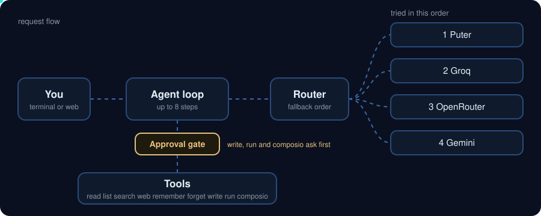

<div align="center">



<p>
  
  
  
  
</p>

</div>

# JOEBOT: terminal AI agent with tool calling

JOEBOT is a personal AI agent for the terminal. It reads and searches your code, runs shell commands, searches the live web and remembers what you tell it, and it asks before it changes anything. It runs in Termux on Android, routes across several AI providers, and also ships a local web app.


## See it work



*An illustrated session, not a recording. Real replies depend on the model that answers.*


## Why it is different

* **Real tool calling.** The model picks tools, the agent loop runs them and feeds the results back, up to 8 steps per request.
* **Safe by default.** Reads and searches run on their own. Writes, shell commands and Composio actions stop at an approval card that waits for your keypress.
* **Provider fallback.** Puter, Groq, OpenRouter and Gemini are tried in a set order, so a rate limit on one does not end your session.
* **Honest reporting.** The core prompt requires JOEBOT to report only what it observed, and to lead with any failure.
* **Personal memory.** Tell it a preference and it keeps it. Tell it to forget and it is gone.
* **Two interfaces.** A terminal interface built with Ink, and a local web app with chat history.


## Tools

* `read_file`, `list_files` and `search_code` work inside the project and allowed storage folders. Automatic.
* `web_search` uses Tavily with the exact words you typed. Start a message with `smart:` and the model rewrites the query instead, which helps with follow up questions. Automatic.
* `remember` and `forget` manage personal memory. Automatic.
* `write_file` creates or changes a file. Needs approval.
* `run_command` runs a shell command. Needs approval.
* `use_composio` finds and runs actions in connected apps such as Gmail or GitHub, and only when you ask for it by name. Needs approval.


## Safety model

* **Approval card.** Typing yes in chat does not count. Only the keypress on the card does.
* **File sandbox.** Access is limited to the project folder and shared storage. Symlinks are resolved, and `.env`, `.git`, `.ssh`, `node_modules` and `.git-credentials` are blocked.
* **Shell guard.** Destructive patterns and anything touching your `.env` or API keys are refused. Paths outside the project are rejected. Commands time out after 30 seconds and output is capped at 8000 characters.
* **Context limits.** Tool results are truncated before they go back to the model, and history is capped at 20 messages, which keeps small free tiers working.


## How it works



1. You send a message from the terminal or the web app.
2. The agent loop sends the conversation and the tool definitions to the router.
3. The router tries the providers in order and returns either a reply or tool calls.
4. Safe tools run immediately. Risky tools wait at the approval gate.
5. Results go back to the model, and the loop repeats until it has a final answer or reaches 8 steps.

The order and models live in `server/config/models.js`.


## Quick start

You need Node.js (tested on v26), Termux on Android, and keys for the providers you want to use.

```bash
git clone https://github.com/JoeBuildsThings/joebot.git ~/joebot
cd ~/joebot
npm install
```

Create a `.env` file in the project folder:

```bash
PUTER_AUTH_TOKEN=
GROQ_API_KEY=
OPENROUTER_API_KEY=
GEMINI_API_KEY=
TAVILY_API_KEY=
COMPOSIO_API_KEY=
COMPOSIO_USER_ID=
```

* `PUTER_AUTH_TOKEN`, `GROQ_API_KEY`, `OPENROUTER_API_KEY` and `GEMINI_API_KEY` are the four model providers.
* `OPENROUTER_MODEL` is optional and overrides the OpenRouter model.
* `TAVILY_API_KEY` powers web search.
* `COMPOSIO_API_KEY` and `COMPOSIO_USER_ID` enable connected app actions.

Start the terminal interface from the project folder:

```bash
npx tsx --env-file=.env cli/tui/App.jsx
```

Or start the local web app and open http://127.0.0.1:8765:

```bash
npm start
```

Optional: run `npm link` to get the `joebot` command, which loads the `.env` from the project folder.


## Project layout

```text
bin/            launcher for the joebot command
cli/            agent loop and the Ink terminal interface
server/ai/      router, personality, memory and provider adapters
server/tools/   file, shell, search, web search and Composio tools
server/         Express app and chat manager for the web interface
public/         web interface
```


## Status and known limits

* Active development, with no automated tests yet.
* Fallback moves to the next provider when one fails, and reports every error if all of them fail. It does not judge weak replies.
* Terminal chats are not saved between sessions yet.
* Termux on Android is the only platform tested so far.

## Roadmap

* Polish the terminal interface
* Resume saved chats
* Summarize old context instead of trimming it
* Portable launcher and install script
* Automated tests


## Author

Built by Adebiyi Joseph Ayomide ([JoeBuildsThings](https://github.com/JoeBuildsThings)). Portfolio: [joebuildsthings.netlify.app](https://joebuildsthings.netlify.app).

## License

ISC. See the [LICENSE](LICENSE) file.
